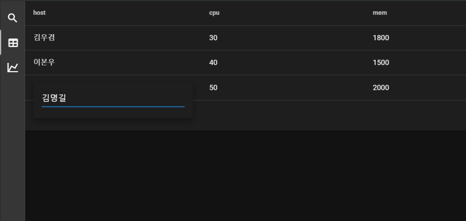

# dashboard

## 프로그램 설명
백엔드는 Flask를 이용한 Rest 서비스를 오픈하고, 프런트는 Vue & Vuetify를 이용해서 개발하는 예시코드이다.



flask는 다음의 2개 서비스를 열고 있다.
- GET: /rest/get : 데이터를 프런트로 제공 함
- SET: /rest/set : 프런트에서 변경된 row를 받아서 데이터를 업데이트 함

UI는 3개의 Tab으로 구성되어 있으며 실질적으로 작동하는 Tab은 Table이고, 나머지는 더미 페이지이다.
Table Tab이 오픈되면 서버로부터 데이터를 받아와서(/rest/get) 화면에 테이블을 그린다. 사용자가 테이블의 Cell을 클릭해서 내용을 변경하면 즉시 서버로 업데이트(/rest/set) 요청을 한다. 

## 필요 패키지
Python 3 및 nodejs 를 이용해서 개발한 프로젝트로써 시작 전 개발환경에 설치가 필요하다.
- python: https://www.python.org/
- nodejs: https://nodejs.org/

그리고 다음의 모듈 및 패키지를 설치를 설치한다.

- flask & flask-cors 설치
```
pip install flask flask-cors
```
- vue 설치
```
npm install @vue/cli
```

## 폴더 설명
### Server
- server.py : 프로젝트 루트에 위치하고 있으며 rest서비스 및 web서비스를 담당한다. Flask 프레임워크로 개발되어 있다.
- static 폴더 : vue front end가 빌드되면 결과물이 저장되는 폴더이며, Flask에 의해서 서비스 된다.
- front_src/dashboard : vue로 개발된 front 소스코드가 위치한 곳이다.
- front_src/dashboard/App.vue: Main화면 코드로써 레이아웃 선언을 하고 좌측 메뉴바 코드가 포함되어있다.
- front_src/dashboard/components/table-view.vue: 테이블 예제가 코딩되어 있으며, flask와 통신해서 데이터를 주고 받는 코드가 포함되어 있다.
- front_src/dashboard/components/chart-view.vue, front_src/dashboard/components/search-view.vue: 탭전환 예시를 위한 더미코드이다.

## 사용한 라이브러리
- Vue.js: https://kr.vuejs.org/v2/guide/index.html
- Vuetify.js: https://vuetifyjs.com/
- Material Design Icon: https://materialdesignicons.com/

## 실행 방법
### Development 모드
백엔드와 프런트엔드를 분리해서 실행하는 방법으로써, 개발시 따로 실행할 수 있고, 프런트는 Hot Update기능을 사용할 수 있어서 개발 속도를 높일 수 있다.

- 백엔드 서버 실행
프로젝트 루트에서 다음의 명령을 실행한다.
```
python server.py
```
- 프런트 서버 실행
프런트 프로젝트 폴더로 이동한다.
```
cd ./front_src/dashboard
```
최초 실행할때 필요한 모듈을 설치해야 한다.
2번째 실행부터는 이미 설치했기 때문에 실행할 필요가 없다.
```
npm install
```
다음의 명령으로 서버를 실행한다.
```
npm run serve
```

웹브라우져를 열고 http://localhost:8080 (디폴트 포트, 사용중이면 다른 포트가 할당된다.) 으로 접속하면 화면을 볼 수 있다.

### Production 모드
프런트엔드를 빌드해서 백엔드(Flask)서버 하나로 서비스 바는 방법, 최종 배포시 이렇게 배포해야 한다.

프런트 프로젝트 폴더로 이동한다.
```
cd ./front_src/dashboard
```
최초 실행할때 필요한 모듈을 설치해야 한다.
2번째 실행부터는 이미 설치했기 때문에 실행할 필요가 없다.
```
npm install
```
다음의 명령으로 서버를 실행한다.
```
npm run build
```
빌드한 결과물은 /static 폴더에 저장된다.

프로젝트 루드로 이동해서 백엔드서버(Flask)를 실행한다.
```
python server.py
```

웹브라우져를 열고 http://localhost:5000 (디폴트 포트, 사용중이면 다른 포트가 할당된다.) 으로 접속하면 화면을 볼 수 있다.
